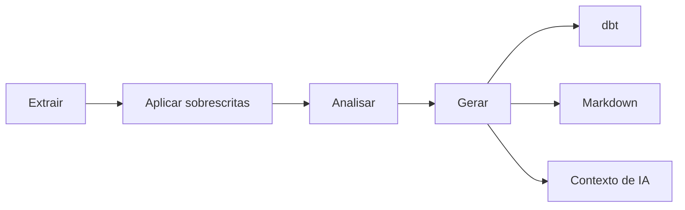

# ddf

[](https://github.com/ThiagoLimaC/ddf/actions/workflows/ci.yml)
[](https://pypi.org/project/ddf-framework/)
[](https://pypi.org/project/ddf-framework/)
[](LICENSE)

**`ddf`: framework de análise em batch que transforma um banco relacional em projeto dbt, documentação e contexto de IA — extensível por plugins.**

Bancos relacionais acumulam tabelas, colunas e relacionamentos que, sem documentação atualizada, tornam entender essa estrutura do zero um trabalho manual, repetitivo e que envelhece rápido. O `ddf` conecta a uma fonte de dados (hoje **Postgres e MariaDB**) extrai a estrutura completa e métricas reais das tabelas em paralelo e, a partir dessa única extração, gera **três artefatos versionáveis**: um **projeto dbt rodável**, **documentação Markdown navegável** e **contexto denso em JSON para agentes de IA**.

Todo artefato fica disponível para revisão normal de código antes de qualquer uso. E a curadoria humana (papel de negócio, regras de tabelas/colunas) é feita em YAML e **preservada entre reexecuções**: reextrair a mesma fonte sem mudança estrutural nunca apaga o que já foi curado; quando algo muda de fato, o `ddf` avisa exatamente o que mudou.

Sem inspeção manual de schema, sem escrever sources/modelos/testes dbt à mão a cada fonte nova.

<!-- TODO: gif de demonstração do wizard rodando de ponta a ponta (ex.: site_docs/assets/demo.gif) -->
<!--  -->

📖 Documentação completa: **https://thiagolimac.github.io/ddf/**

## Instalação

> O nome de publicação no PyPI é `ddf-framework`; o comando de linha de comando continua sendo `ddf`.

```bash
pip install ddf-framework
```

Requer Python 3.12+.

## Uso

```bash
ddf
```

O wizard conduz: escolher a fonte (Postgres ou MariaDB) → conectar → escolher escopos e tabelas → escolher a estratégia de amostragem → extrair → revisar/curar overrides → escolher os artefatos a gerar → confirmar.

Guia completo (com exemplos e artefatos gerados): [thiagolimac.github.io/ddf/guia-rapido/](https://thiagolimac.github.io/ddf/guia-rapido/)

## O que ele gera

- **Projeto dbt** pronto para rodar — `dbt_project.yml`, `sources.yml`, modelos de staging e `schema.yml` já com testes de qualidade sugeridos a partir das métricas reais extraídas.
- **Documentação Markdown** navegável, versionável junto do código.
- **Contexto de IA** em JSON (`index.json` + um arquivo por tabela), pensado para um agente consumir a estrutura sem acessar o banco.

## Arquitetura

O `ddf` segue hexagonal (Ports & Adapters) com DDD por Bounded Contexts (Extraction, Curation, Analysis). Hoje os adaptadores nativos da v1 conectam a **Postgres e MariaDB** — a arquitetura é extensível a novas fontes (e a novos geradores de artefato) via plugin, sem exigir reescrita: terceiros registram Adapters via `entry_points` (`ddf.extratores`/`ddf.geradores`).

```
src/ddf/
├── domain/          # domain — modelo + Ports (contratos)
├── infrastructure/  # adapters
└── pipeline/        # orchestration
```



Cada Estágio do pipeline (Extrator, Analisador, Gerador) e cada Adapter novo carrega três categorias obrigatórias de teste (caminho feliz, erro esperado e borda), passa por `mypy --strict` e `ruff` antes de todo commit, e o CI nunca mergeia com o pipeline vermelho.


Diagrama completo (Bounded Contexts, ACLs, paralelismo interno) e o porquê das decisões: [Arquitetura](https://thiagolimac.github.io/ddf/arquitetura/).

## Licença

MIT — ver [LICENSE](LICENSE).
