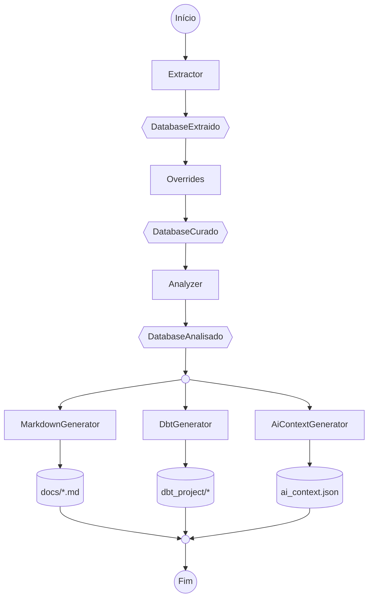

# System Design — ddf (novo)

Este documento descreve a arquitetura de alto nível do `ddf`.

## Estilo arquitetural: hexagonal escopado, não hexagonal completo

O `ddf` adota **Ports & Adapters (hexagonal) de forma escopada** — aplicado só
onde existe variação real de implementação, não como arquitetura de domínio
completa.

**Onde o hexagonal é aplicado (as três bordas de variação real):**

- **Extractor** é uma `Port` (`Protocol`) porque existe mais de uma fonte de
  dados real prevista todas
  precisam produzir o mesmo `DatabaseExtraido` neutro, sem o restante do sistema
  saber qual `Adapter` concreto está rodando por trás.
- **Analyzer** é uma `Port` pelo mesmo motivo, no meio do pipeline: existe mais
  de uma heurística de análise real (`TableMetricsAnalyzer`,
  `ColumnMetricsAnalyzer`, e qualquer heurística nova que um usuário queira
  plugar — ex.: inferência de FK por convenção de nome). Um Analyzer novo
  consome `DatabaseCurado` e produz `DatabaseAnalisado` sem exigir mudança em
  nenhum Analyzer já existente, exatamente a mesma garantia que Extractor e
  Generator já têm.
- **Generator** é uma `Port` pelo mesmo motivo, espelhado na saída: existe mais
  de um formato de artefato real (Markdown, dbt, contexto de IA), todos
  recebendo o mesmo `DatabaseAnalisado`.

**Onde o hexagonal é deliberadamente *não* aplicado:**

- **Overrides (curadoria)** não é uma `Port` — existe uma única implementação
  (YAML), então criar uma interface ali seria abstração sem variação real para
  justificá-la.
- **Não há camadas de domínio ricas estilo DDD** (sem `domain/event/`, sem
  subdivisão por agregados) — a complexidade deste projeto está nos dados e nas
  transformações, não em invariantes de negócio que justifiquem esse vocabulário.

## Visão geral

O `ddf` é uma ferramenta de linha de comando que executa **sob demanda** (não um
serviço de longa duração) um pipeline de quatro estágios sobre uma fonte de
dados:

```
Extrair → Aplicar overrides → Analisar → Gerar
```

Cada execução parte de uma fonte de dados, produz um modelo de domínio em memória, 
e termina escrevendo em disco um ou mais artefatos versionáveis (documentação Markdown, 
projeto dbt, contexto de IA). Não há estado persistente entre execuções além do que o 
próprio usuário versiona em Git (overrides em YAML, artefatos gerados).



## Componentes

### 1. Extractor

Responsável por conectar a uma fonte de dados e produzir um `DatabaseExtraido` —
o modelo estrutural cru (tabelas, colunas, tipos com precisão, chaves
primárias/estrangeiras), sem métricas calculadas e sem curadoria humana ainda
aplicada.

- Implementação: `PostgresExtractor`, lendo `information_schema`.
- Variação esperada: um `Extractor` por fonte
  (MariaDB, arquivo, API) — todos produzindo o mesmo `DatabaseExtraido` neutro,
  para que nenhum componente downstream precise saber de qual fonte os dados
  vieram.

### 2. Overrides (curadoria)

Aplica, sobre o `DatabaseExtraido`, campos de curadoria humana (papel de negócio
da tabela/coluna, regras) lidos de YAML versionado pelo usuário
(`overrides/<schema>/<tabela>.yaml`).

Garante idempotência: compara a estrutura atual da fonte com a última conhecida
(via hash de campos estruturais — nome, tipo, PK/FK) e só adiciona/remove campos
de curadoria quando a estrutura de fato mudou, nunca apaga curadoria já feita por
um humano sem necessidade.

Produz um `DatabaseCurado` — tipo próprio, distinto de `DatabaseExtraido` — a
partir do `DatabaseExtraido` recebido. Roda **antes** da análise de métricas — a
curadoria de negócio não depende de nenhuma métrica calculada, e expor esses
campos cedo simplifica o restante do pipeline.

### 3. Analyzer

Calcula métricas sobre o `DatabaseCurado` (nulos, cardinalidade, valores mais
frequentes, formato detectado por regex — email/cpf/cnpj/telefone/cep) e produz o
`DatabaseAnalisado`, preservando os campos de curadoria já aplicados pelo estágio
anterior.

`DatabaseExtraido`, `DatabaseCurado` e `DatabaseAnalisado` são três modelos
distintos — não a mesma estrutura reaproveitada em estados implícitos. Isso
existe para que seja estruturalmente impossível um Generator receber dados sem
métricas calculadas, e igualmente impossível um Analyzer (ou Generator) receber
dados que nunca passaram pela etapa de curadoria — cada etapa só aceita o tipo
que a etapa anterior se compromete a produzir.

Implementações: `TableMetricsAnalyzer` e `ColumnMetricsAnalyzer`. Analyzer
é uma `Port`, assim como Extractor e Generator — qualquer pessoa pode plugar um
Analyzer novo (uma heurística de qualidade, uma inferência de relacionamento)
contribuindo um `Adapter` que implemente o `Protocol`, sem editar nenhum Analyzer
já existente. Analyzers não sabem de qual fonte os dados vieram — operam só
sobre o tipo neutro (`DatabaseCurado`). Um Analyzer novo não exige mudança em
nenhum Extractor, e vice-versa.

### 4. Generator

Recebe o `DatabaseAnalisado` completo (estrutura + métricas + curadoria) e
escreve um artefato em disco. Três implementações:

- **MarkdownGenerator** — documentação navegável.
- **DbtGenerator** — projeto dbt rodável
  (`dbt_project.yml`, `sources.yml`, modelos de staging, `schema.yml` com testes
  de qualidade sugeridos deterministicamente a partir das métricas).
- **AiContextGenerator** — contexto denso em JSON para consumo por agentes de IA.

Cada Generator é independente dos demais — adicionar um Generator novo, ou rodar
um subconjunto deles numa execução, não exige alterar os já existentes.

### 5. CLI (wizard)

Única interface de entrada do produto. Conduz o usuário por: escolher fonte →
conectar → extrair → pausa para curadoria → aplicar overrides → analisar →
escolher quais artefatos gerar → confirmar → executar. 

## Fluxo de dados — contratos entre estágios

| Estágio | Entrada | Saída |
|---|---|---|
| Extractor | credenciais/connection string | `DatabaseExtraido` |
| Overrides | `DatabaseExtraido` + YAML existente | `DatabaseCurado` |
| Analyzer | `DatabaseCurado` | `DatabaseAnalisado` |
| Generator | `DatabaseAnalisado` | artefato em disco |

O tipo de cada coluna (`DataType`) carrega categoria (`VARCHAR`, `NUMERIC`,
`TIMESTAMP` etc.) mais atributos de precisão opcionais (`precision`, `scale`,
`max_length`), populados pelo Extractor a partir da fonte. Todo componente
downstream consome esse tipo neutro — nunca uma string crua específica de uma
fonte.

## Composição e extensibilidade

O pipeline inteiro é montado como uma **composição de estágios**, não uma
sequência de chamadas fixas dentro de uma classe orquestradora. Isso é o que
garante, na prática:

- **Adicionar um Generator, Analyzer ou Extractor novo** = incluir mais um item na lista
  de estágios correspondente da composição — nenhum componente existente muda.
- **Pular a extração** (quando o `DatabaseAnalisado` já existe de uma execução
  anterior) = simplesmente não incluir o estágio de extração naquela composição —
  não é um parâmetro opcional carregado por toda execução.
- **Um estágio falha** = a composição para imediatamente nesse ponto, devolvendo
  o erro de forma explícita; nenhum estágio seguinte roda, e o resultado (e
  avisos) de estágios anteriores bem-sucedidos não é descartado.
- **Tratamento de erro uniforme** — toda etapa devolve sucesso ou falha de forma
  explícita; uma falha esperada (conexão recusada, schema ausente, arquivo
  malformado) nunca aparece para o usuário como um erro técnico não tratado — a
  CLI sempre imprime uma mensagem clara e termina com código de saída diferente
  de zero.

## Persistência e estado

- **Sem banco de dados próprio.** O único estado persistido pelo `ddf` entre
  execuções é o que o usuário versiona em Git: os arquivos YAML de overrides e os
  artefatos gerados (Markdown, projeto dbt, JSON de contexto).
- **Sem processo de longa duração.** Cada execução é uma chamada de CLI que
  termina; não há serviço escutando porta, não há monitoramento contínuo da
  fonte.
- **Idempotência por hash de estrutura**, não por timestamp — rodar a mesma
  extração duas vezes sobre uma fonte inalterada produz o mesmo resultado e não
  toca em curadoria já existente.

## Limites do sistema (system boundary)

O `ddf` só fala com a fonte de dados durante a etapa de extração de uma execução
ativa — nunca mantém conexão aberta entre execuções, nunca expõe um endpoint
consultável. Tudo que sai do sistema é arquivo em disco, revisável como qualquer
outra mudança de código.

## Decisões de arquitetura que moldam este design

1. **Tipo de coluna neutro e rico desde o início** — evita que trocar de fonte
   de dados quebre os Generators, e preserva precisão necessária para artefatos
   tecnicamente corretos.
2. **Pipeline como estágios compostos, não classe orquestradora com `if`s** —
   evita duplicação de orquestração e bugs de resultado mascarado entre etapas.
3. **Três tipos distintos — `DatabaseExtraido`, `DatabaseCurado`,
   `DatabaseAnalisado`** — torna estruturalmente impossível pular a etapa de
   overrides ou a etapa de análise antes de gerar um artefato; cada estágio só
   compila contra o tipo que a etapa anterior se compromete a produzir.
4. **Overrides aplicados antes da análise**, não depois — curadoria de negócio
   não depende de métrica calculada.
5. **Generators e Analyzers desacoplados entre si e da fonte de origem** —
   nenhum Generator ou Analyzer sabe se os dados vieram de Postgres, arquivo ou
   API; Extractor, Analyzer e Generator são as três `Port`s do sistema, cada uma
   plugável de forma independente.
