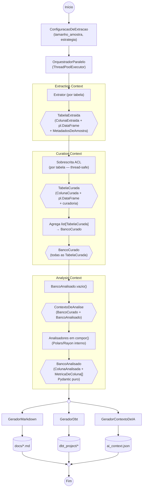

# System Design — ddf (novo)

Este documento descreve a arquitetura de alto nível do `ddf`.

## Estilo arquitetural: hexagonal escopado com DDD por Bounded Contexts

O `ddf` adota **Ports & Adapters (hexagonal) com DDD aplicado por Bounded
Contexts** — não DDD completo com agregados, eventos e repositórios, mas o
subconjunto preciso que resolve o problema real do projeto: **métricas mudam
constantemente, e o modelo de domínio não deve mudar junto com elas**.

### Os três Bounded Contexts

| Context | Representação de coluna | Responsabilidade |
|---|---|---|
| **Extraction** | `ColunaExtraida` | Estrutura pura da fonte |
| **Curation** | `ColunaCurada` | Estrutura + curadoria humana |
| **Analysis** | `ColunaAnalisada` | Estrutura + curadoria + métricas (Value Objects) |

Cada contexto tem sua própria representação de coluna e tabela. Mudanças em
métricas ficam confinadas ao Analysis Context — sem tocar em Extraction nem
em Curation. As Anti-Corruption Layers entre contextos são:

- **Sobrescrita** — ACL entre Extraction e Curation: traduz `TabelaExtraida` →
  `TabelaCurada`, aplicando curadoria humana.
- **Analisador** — ACL entre Curation e Analysis: traduz `BancoCurado` →
  `BancoAnalisado`, calculando métricas como Value Objects.

### Onde o hexagonal é aplicado (as quatro Ports)

- **Extrator** — `Porta` porque existe mais de uma fonte de dados real
  (Postgres, MariaDB, arquivo, API) — todas produzindo o mesmo `TabelaExtraida`
  neutro.
- **Analisador** — `Porta` porque existe mais de uma heurística de análise
  real, e qualquer usuário pode plugar uma nova sem alterar nenhuma existente.
- **Gerador** — `Porta` porque existe mais de um formato de artefato
  (Markdown, dbt, contexto de IA), todos consumindo o mesmo `BancoAnalisado`.
- **OrquestradorDeTabelas** — `Porta` porque existe mais de uma estratégia de
  execução (`OrquestradorParalelo`, futuramente `OrquestradorDistribuido`).

### Onde DDD/hexagonal é deliberadamente *não* aplicado

- **Sobrescritas** não é uma `Porta` — existe uma única implementação (YAML).
- **Sem agregados, eventos de domínio ou repositórios** — a complexidade do
  projeto está nas transformações de dados, não em invariantes de negócio que
  justifiquem esse vocabulário.

## Visão geral do pipeline

```
Extrair → Aplicar sobrescritas → Analisar → Gerar
```

O processamento é **por tabela em paralelo** desde a v1 — o
`OrquestradorParalelo` extrai e aplica sobrescritas em múltiplas tabelas
simultaneamente via `ThreadPoolExecutor`, agrega as `TabelaCurada` resultantes
em `BancoCurado`, e entrega para o Analisador processar com Polars
(paralelismo interno via Rayon).



## Componentes

### 1. Extrator (Extraction Context)

Produz uma `TabelaExtraida` por tabela — `ColunaExtraida`s (estrutura pura),
amostra como `pl.DataFrame` e `MetadadosDeAmostra`.

- **Único componente com acesso ao banco** — nenhum outro estágio abre conexão.
- Usa `psycopg2.pool.ThreadedConnectionPool` para suporte ao paralelo.
- `EstrategiaDeAmostragem` plugável via `ConfiguracaoDeExtracao` — nenhuma
  camada sabe que `tamanho_amostra` existe além do Extrator.

### 2. EstrategiaDeAmostragem

Controla a query de amostragem por tabela. Plugável via
`ConfiguracaoDeExtracao`.

- `LimiteAleatorio` — `SELECT * FROM tabela LIMIT N` (padrão v1)
- Extensão futura: `TableSample`, `FullScan`, estratégia por tabela.

### 3. MetadadosDeAmostra

Value Object que viaja com `TabelaExtraida` e `TabelaCurada`:

```python
class MetadadosDeAmostra(BaseModel):
    estrategia: str      # "random_limit", "tablesample", "full_scan"
    tamanho_amostra: int # linhas efetivamente amostradas
    total_linhas: int    # total real da tabela
```

Usado pelo Analisador para normalizar métricas e pelos Geradores para
declarar nos artefatos que as métricas são estimativas sobre amostra.

### 4. OrquestradorDeTabelas

`Porta` que coordena o processamento paralelo das tabelas em duas fases
distintas — separadas para que a CLI possa pausar entre elas para curadoria
humana dos skeletons de sobrescrita:

- **`extrair(schemas, extrator)`** — extração paralela, retorna
  `list[TabelaExtraida]`.
- **`aplicar_sobrescritas(tabelas, sobrescrita)`** — sobrescrita paralela,
  retorna `BancoCurado`.

`OrquestradorParalelo` (v1) implementa as duas fases com `ThreadPoolExecutor`.
Extensão futura: `OrquestradorDistribuido` com Ray ou Celery — honrando o
mesmo contrato de duas fases. O Analisador roda **fora do pool** — Polars/Rayon
já paralelize internamente.

### 5. Sobrescrita (Anti-Corruption Layer: Extraction → Curation)

`Estagio[TabelaExtraida, TabelaCurada]` — traduz entre os dois primeiros
Bounded Contexts. Puro e thread-safe por design: não agrega, não acumula
estado.

Aplica `papel_de_negocio`/`regras_de_negocio` de
`overrides/<schema>/<tabela>.yaml`. Garante idempotência via hash de campos
estruturais. Na primeira execução, gera skeleton YAML e a CLI pausa aguardando
confirmação do usuário.

### 6. Analisador (Anti-Corruption Layer: Curation → Analysis)

Recebe um `ContextoDeAnalise` — que carrega `BancoCurado` (amostras
`pl.DataFrame`) e `BancoAnalisado` (acúmulo parcial de métricas) — e produz
um `ContextoDeAnalise` enriquecido com as métricas que calculou.

**Métricas são Value Objects (`MetricaDeColuna`, `MetricaDeTabela`)**, não
campos fixos do modelo. Cada Analisador declara o que produz (`produz`) e o
que requer de Analisadores anteriores (`requer`). A CLI valida essas
dependências antes de rodar qualquer Analisador.

- **Polars é detalhe de implementação** — nenhum outro componente vê `pl.DataFrame`.
- `BancoCurado` é o único modelo com `arbitrary_types_allowed=True`.
- Os DataFrames são descartados após cada tabela ser processada.
- `BancoAnalisado` é Pydantic puro, sem DataFrames.

### 7. Gerador (Saída do Analysis Context)

Recebe `BancoAnalisado` (estrutura + curadoria + métricas como Value Objects)
e escreve artefatos em disco. Declara `requer` — os tipos de métricas que
precisa para funcionar. A CLI valida antes de rodar.

- **GeradorMarkdown** — documentação navegável.
- **GeradorDbt** — projeto dbt rodável com testes sugeridos. Única saída cujo
  conteúdo (nomes de coluna/tabela em `schema.yml`, `sources.yml`, SQL) segue
  o contrato do dbt e permanece em inglês.
- **GeradorContextoDeIA** — contexto JSON para agentes de IA.

### 8. CLI (wizard)

Conduz: escolher fonte → conectar → extrair (paralelo) → gerar skeletons →
**pausa para curadoria** → aplicar sobrescritas → validar
Analisadores+Geradores → analisar → escolher artefatos → confirmar → executar.

Exibe `Aviso`s em streaming por etapa concluída.

## Fluxo de dados — contratos entre estágios

| Estágio | Entrada | Saída |
|---|---|---|
| Extrator (por tabela) | credenciais + `ConfiguracaoDeExtracao` | `TabelaExtraida` |
| OrquestradorParalelo.extrair | schemas + Extrator | `list[TabelaExtraida]` |
| [pausa para curadoria humana] | — | — |
| Sobrescrita (por tabela) | `TabelaExtraida` | `TabelaCurada` |
| OrquestradorParalelo.aplicar_sobrescritas | `list[TabelaExtraida]` | `BancoCurado` |
| Analisador (cada um) | `ContextoDeAnalise` | `ContextoDeAnalise` |
| Pipeline extrai | `ContextoDeAnalise` | `BancoAnalisado` |
| Gerador | `BancoAnalisado` | artefato em disco |

## Memória e tempo esperados (50 tabelas × 10.000 linhas × 20 colunas)

| Estágio | Memória (pico) | Tempo estimado |
|---|---|---|
| Extrator paralelo (8 workers) | ~6 MB por thread em voo | ~15-20s |
| Sobrescrita paralela | idem — sem acumulação | incluso acima |
| Agregação → BancoCurado | ~290 MB (50 DataFrames Polars) | ~400ms |
| Analisadores em compor() | decrescente conforme descarta DataFrames | ~5-10s |
| Geradores | ~5-15 MB | ~1-3s |
| **Total** | **pico ~290 MB** | **~20-35s** |

## Persistência e estado

- **Sem banco de dados próprio** — estado persistido = YAML de sobrescritas +
  artefatos gerados, ambos versionados em Git pelo usuário.
- **Sem processo de longa duração** — cada execução é uma chamada de CLI.
- **Idempotência por hash de estrutura** — reexecução sobre fonte inalterada
  não toca em curadoria existente.

## Decisões de arquitetura

1. **DDD com Bounded Contexts** — métricas mudam constantemente; confiná-las
   ao Analysis Context como Value Objects garante que nenhuma mudança de métrica
   toque no Extraction ou Curation Context.
2. **`MetricaDeColuna` e `MetricaDeTabela` como Value Objects** — Analisador
   novo = novo tipo de Value Object + arquivo novo; zero mudanças no modelo
   existente.
3. **`produz`/`requer` em Analisadores e Geradores** — dependências entre
   Analisadores e entre Analisadores/Geradores são explícitas e validadas pela
   CLI antes de qualquer execução, nunca descobertas em runtime.
4. **`ContextoDeAnalise` como entrada/saída dos Analisadores** — carrega
   `BancoCurado` (amostras) e `BancoAnalisado` (métricas acumuladas); cada
   Analisador lê o que precisa e acrescenta suas métricas sem sobrescrever as
   de outros.
5. **Extrator é o único ponto de acesso ao banco** — Analisador opera sobre
   amostras já carregadas, sem reabrir conexão.
6. **`arbitrary_types_allowed=True` apenas em `BancoCurado`** — o único ponto
   onde `pl.DataFrame` existe no modelo; `BancoAnalisado` é Pydantic puro.
7. **Sobrescrita e Analisador como ACLs explícitas** — a fronteira entre
   contextos é um componente real no código, não uma convenção documentada.
   A Sobrescrita tem **responsabilidade única** (produzir `TabelaCurada` a partir
   de `TabelaExtraida`), cumprida em duas fases internas distintas: `_traduzir`
   (mapeamento estrutural `ColunaExtraida` → `ColunaCurada`) e `_aplicar_overrides`
   (aplicar curadoria do YAML). As fases têm razões de mudança diferentes — uma
   muda quando a estrutura da fonte muda; a outra quando as regras de curadoria
   mudam — por isso ficam separadas internamente, mas não justificam dois
   componentes distintos.
8. **`OrquestradorDeTabelas` como `Porta` desde a v1** — trocar
   `ThreadPoolExecutor` por Ray/Celery não altera nenhum Estagio.
9. **`EstrategiaDeAmostragem` plugável via `ConfiguracaoDeExtracao`** — mudar
   estratégia de amostragem = trocar objeto injetado; nenhuma outra camada
   muda.
10. **Pipeline como estágios compostos** — adicionar Analisador ou Gerador
    novo = incluir mais um item na composição; nenhum componente existente
    muda.
