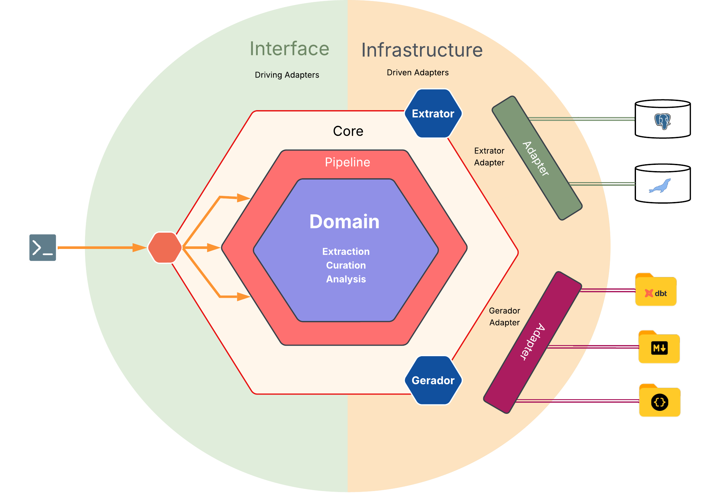
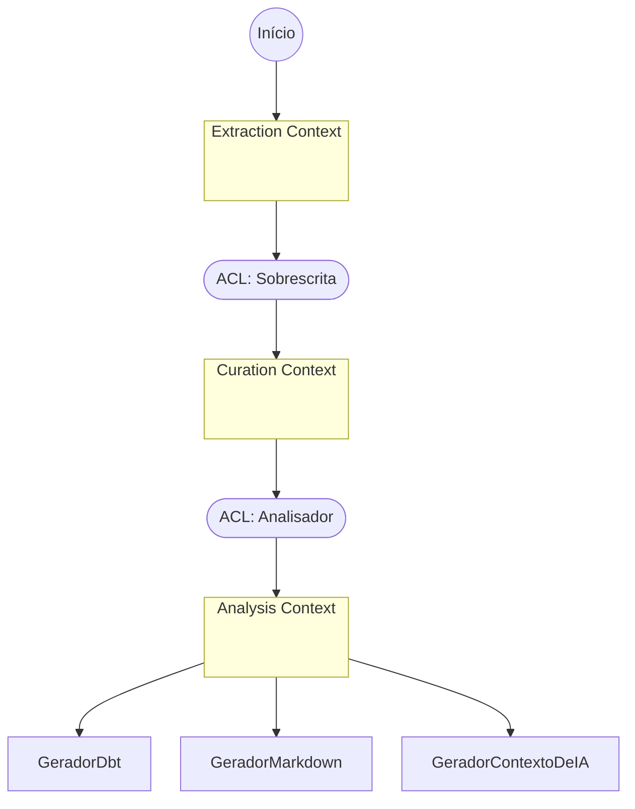

# Arquitetura

Esta página e as demais desta seção explicam 
qual problema cada peça resolve e por que foi resolvido desse jeito. O comportamento de
cada etapa do wizard já está descrito no [Guia do usuário](../guia/extracao.md); aqui o
assunto é o desenho por trás dele.

O `ddf` nasce do cruzamento entre arquitetura de backend, ciência de dados e engenharia de
dados. Cada disciplina contribui um critério de decisão diferente, e o primeiro deles, já
na base do projeto, decide por que dado e métrica vivem em modelos separados.

## Hexagonal: Ports & Adapters, sem a receita completa

O `ddf` adota Ports & Adapters, mas só a fatia que resolve um problema real do projeto.
Porta existe onde existe (ou está previsto existir) mais de uma implementação real para o
mesmo papel, caso de `Extrator`, `Analisador`, `Gerador`, `OrquestradorDeTabelas` e
`EstrategiaDeAmostragem` (as cinco em detalhe em [Portas e adaptadores](portas-e-adaptadores.md)).
Onde essa variação não existe, a Porta também não existe. Sobrescrita, por exemplo, tem uma
única implementação real (YAML), sem comportamento a acomodar, e por isso vira import
direto.

O diagrama acima ilustra essa mesma fronteira. Nas bordas, os dois lados que sabem que o
mundo exterior existe: a CLI, um adapter inbound, age diretamente sobre `pipeline/` (mais
especificamente `pipeline/etapas/`, único ponto de chamada às Ports a partir da CLI); do
outro lado, os adapters outbound conectam a fontes reais (Postgres, MariaDB) e formatos de
artefato (projeto dbt, docs Markdown, docs de contexto para IA). No núcleo, Domain e
Pipeline não conhecem nenhum desses dois lados; entre eles, as Portas que foram aqui representadas
só por `Extrator` e `Gerador`, as duas únicas extensíveis por plugin de terceiro (ver
[Política de extensão](portas-e-adaptadores.md#politica-de-extensao-quem-e-plugin-quem-nao-e)).

O anel "Pipeline" em volta do "Domain" comunica pipeline como camada de composição em torno do domínio, sem
representar `pipeline/` como um módulo que envolve fisicamente os tipos de domínio no
código.

## DDD: Bounded Contexts, sem agregados nem eventos de domínio

O `ddf` aplica DDD por Bounded Contexts, também como subconjunto, porque métricas mudam
com frequência (uma heurística de análise nova, um formato detectado novo, um teste de
qualidade sugerido novo) e o modelo de domínio não pode mudar toda vez que isso acontece.

A resposta foi dar à mesma "coluna" três representações, uma por Bounded Context:

| Context | Representação de coluna | Responsabilidade |
|---|---|---|
| Extraction | `ColunaExtraida` | Estrutura pura, como veio da fonte. |
| Curation | `ColunaCurada` | Estrutura mais curadoria humana (papel de negócio, regras). |
| Analysis | `ColunaAnalisada` | Estrutura, curadoria e métricas, estas últimas como Value Objects. |

Cada contexto muda por um motivo próprio. Métrica nova não toca em Extraction nem em
Curation ficando inteiramente confinada ao Analysis Context (ver
[Métricas como Value Objects](metricas-como-value-objects.md)). A tradução entre contextos
passa por duas Anti-Corruption Layers: Sobrescrita, entre Extraction e Curation, e
Analisador, entre Curation e Analysis.

Também não há agregados, eventos de domínio ou repositórios. A complexidade real do `ddf`
está em transformar dado (extrair, curar, calcular métrica, gerar artefato), não em
proteger invariante de negócio contra estado inconsistente. Não existe estado mutável
compartilhado que precise de fronteira de consistência, então falta motivo para importar o
vocabulário de agregado.

O `ddf` também não tem banco de dados próprio nem processo de longa duração. O que
sobrevive entre execuções é o YAML de sobrescritas e os próprios artefatos gerados,
versionados em Git pelo usuário.

## Como as peças se conectam

Cada seta que cruza um Bounded Context passa por uma ACL nomeada no próprio diagrama, porque
nenhuma tradução entre contextos acontece por conversão implícita de tipo.

## Continue por aqui

- [Portas e adaptadores](portas-e-adaptadores.md): as cinco Portas do `ddf`, o critério que
  decide se algo vira Porta, como a CLI chega até elas através de `pipeline/`, e como os
  Extratores concretos leem o catálogo da fonte.
- [Estratégia de amostragem](estrategia-de-amostragem.md): por que o Port não gera SQL, e
  como `ExtratorPostgres` e `ExtratorMariaDB` traduzem a mesma política de amostragem em
  mecanismos bem diferentes.
- [Métricas como Value Objects](metricas-como-value-objects.md): a regra que confina
  mudança de métrica ao Analysis Context, com um exemplo real de dois Geradores
  reaproveitando o mesmo critério.
- [Hash estrutural](hash-estrutural.md): como a ACL Sobrescrita decide se a estrutura de
  uma tabela mudou desde a última execução, e o que essa decisão preserva ou descarta.
- [Pipeline e paralelismo](pipeline-e-paralelismo.md): por que o pipeline é composição de
  estágios, e os números reais por trás da decisão de paralelismo intra-tabela.
- [Tecnologias](tecnologias.md): a stack do projeto, com o porquê de cada peça central.
- [Testes e qualidade](testes-e-qualidade.md): a política de testes como parte do mesmo
  pacote de decisões de engenharia, não um item à parte.
