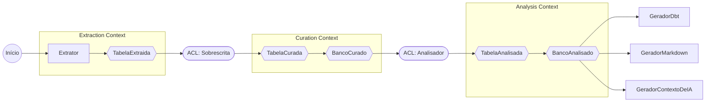

# Arquitetura

Esta página e as demais desta seção explicam o porquê das decisões estruturais do `ddf`:
qual problema cada peça resolve e por que foi resolvido desse jeito. O comportamento de
cada etapa do wizard já está descrito no [Guia do usuário](../guia/extracao.md); aqui o
assunto é o desenho por trás dele.

O `ddf` nasce do cruzamento entre arquitetura de backend, ciência de dados e engenharia de
dados. Cada disciplina contribui um critério de decisão diferente, e o primeiro deles, já
na base do projeto, decide por que dado e métrica vivem em modelos separados.

## Hexagonal escopado com DDD por Bounded Contexts

O `ddf` adota Ports & Adapters (hexagonal) com DDD aplicado por Bounded Contexts, mas não a
versão completa dos dois: é o subconjunto que resolve um problema real do projeto. Métricas
mudam com frequência (uma heurística de análise nova, um formato detectado novo, um teste
de qualidade sugerido novo), e o modelo de domínio não pode mudar toda vez que isso
acontece.

A resposta foi dar à mesma "coluna" três representações, uma por Bounded Context:

| Context | Representação de coluna | Responsabilidade |
|---|---|---|
| Extraction | `ColunaExtraida` | Estrutura pura, como veio da fonte. |
| Curation | `ColunaCurada` | Estrutura mais curadoria humana (papel de negócio, regras). |
| Analysis | `ColunaAnalisada` | Estrutura, curadoria e métricas, estas últimas como Value Objects. |

Cada contexto muda por um motivo próprio. Métrica nova não toca em Extraction nem em
Curation: fica inteiramente confinada ao Analysis Context (ver
[Métricas como Value Objects](metricas-como-value-objects.md)). A tradução entre contextos
passa por duas Anti-Corruption Layers: Sobrescrita, entre Extraction e Curation, e
Analisador, entre Curation e Analysis.

## Onde a adaptação para de seguir a receita

A ressalva "adaptação, não a receita completa" não é modéstia de manual. É uma decisão de
escopo com dois cortes concretos.

Sobrescrita não é uma Porta: existe uma única implementação real (YAML), sem variação de
comportamento a acomodar. Transformar isso em Porta seria abstração sem uso, o mesmo
critério que decide se algo vira Porta no `ddf` (ver
[Portas e adaptadores](portas-e-adaptadores.md)).

Também não há agregados, eventos de domínio ou repositórios. A complexidade real do `ddf`
está em transformar dado (extrair, curar, calcular métrica, gerar artefato), não em
proteger invariante de negócio contra estado inconsistente. Não existe estado mutável
compartilhado que precise de fronteira de consistência, então falta motivo para importar o
vocabulário de agregado.

O `ddf` também não tem banco de dados próprio nem processo de longa duração. O que
sobrevive entre execuções é o YAML de sobrescritas e os próprios artefatos gerados,
versionados em Git pelo usuário, não um Aggregate Root guardando uma transação.

## Como as peças se conectam

Cada seta que cruza um Bounded Context passa por uma ACL nomeada no próprio diagrama:
nenhuma tradução entre contextos acontece por conversão implícita de tipo.

## Continue por aqui

- [Portas e adaptadores](portas-e-adaptadores.md): as cinco Portas do `ddf`, o critério que
  decide se algo vira Porta, e como os Extratores concretos leem o catálogo da fonte.
- [Métricas como Value Objects](metricas-como-value-objects.md): a regra que confina
  mudança de métrica ao Analysis Context, com um exemplo real de dois Geradores
  reaproveitando o mesmo critério.
- [Hash estrutural](hash-estrutural.md): como a ACL Sobrescrita decide se a estrutura de
  uma tabela mudou desde a última execução, e o que essa decisão preserva ou descarta.
- [Pipeline e paralelismo](pipeline-e-paralelismo.md): por que o pipeline é composição de
  estágios, e os números reais por trás da decisão de paralelismo intra-tabela.
- [Tecnologias](tecnologias.md): a stack do projeto, com o porquê de cada peça central.
- [Testes e qualidade](testes-e-qualidade.md): a política de testes como parte do mesmo
  pacote de decisões de engenharia, não um item à parte.
