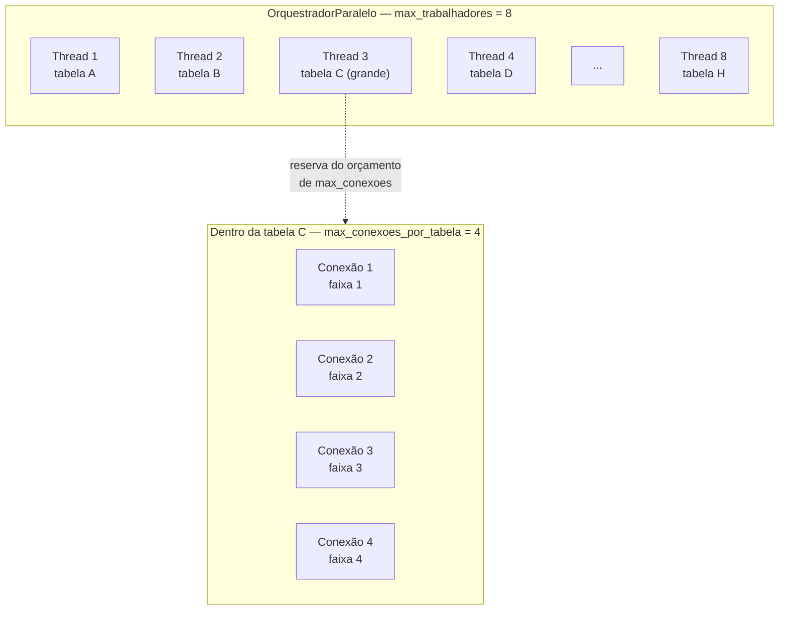

# Pipeline e paralelismo

## Pipeline como estágios compostos

O pipeline do `ddf` é uma composição de estágios: `Extrair → Aplicar sobrescritas →
Analisar → Gerar`. Cada estágio é uma função tipada que recebe um tipo conhecido e devolve
um `Resultado` de um tipo conhecido; `compor()` encadeia os estágios na ordem certa e para
no primeiro erro.

O mecanismo genérico (`compor()`, o `Protocol` `Estagio`, `executar_com_seguranca`) vive em
`pipeline/comum/`. O núcleo de cada etapa do wizard (a chamada de Port propriamente dita)
vive em `pipeline/etapas/`, um módulo por etapa (`extracao.py`, `curadoria.py`,
`analise.py`, `geracao.py`, `validar_dependencias.py`), e é a única camada que a CLI chama
para chegar até uma Port (ver
[CLI: adapter fino](portas-e-adaptadores.md#cli-adapter-fino-pipeline-como-fronteira-unica-ate-as-ports)).

A alternativa mais comum em Clean Architecture seria um Use Case por operação, com uma
classe `ExtrairEAnalisarUseCase`, outra para gerar artefato, cada uma orquestrando suas
próprias dependências. O `ddf` deliberadamente não seguiu esse caminho. Um Use Case por
operação faz sentido quando as operações são pontos de entrada independentes de um sistema
(criar pedido, cancelar pedido, cada um com sua própria regra de negócio). No `ddf`, as
etapas são estágios sequenciais de uma única transformação de dados, não operações
independentes, e a única coisa que varia de execução para execução é quais Analisadores e
Geradores entram na composição.

Com estágios compostos, adicionar um Analisador ou Gerador novo é incluir mais um item na
lista que `compor()` percorre, e nenhum componente existente muda. Reintroduzir uma classe
orquestradora com `if`s decidindo o que rodar é proibido nas convenções internas do
projeto exatamente por essa razão, já que voltaria a acoplar a decisão de "o que rodar" ao
código de cada operação, em vez de deixá-la na composição.

## Paralelismo entre tabelas

`OrquestradorDeTabelas` é Porta desde a v1: `OrquestradorParalelo`
implementa hoje as duas fases (extrair, aplicar sobrescritas) com `ThreadPoolExecutor`, mas
trocar por Ray ou Celery no futuro não exige alterar nenhum Estágio, só uma nova
implementação da mesma Porta. Falha em uma tabela individual nunca aborta o lote inteiro, essa
vira um `Aviso` no `Sucesso` devolvido, junto do que deu certo, e um callback de progresso
opcional alimenta a barra de progresso do wizard sem acoplar a Porta a nenhuma biblioteca
de UI.

`max_trabalhadores` (8 por padrão) limita quantas chamadas concorrentes o
`ThreadPoolExecutor` roda por fase — teto de higiene de recurso local, sem relação com
concorrência segura contra a fonte, que cada Extrator concreto já garante por conta
própria com o próprio orçamento de conexões.

## Paralelismo intra-tabela: uma decisão movida por medição, não por intuição

Paralelismo entre tabelas resolve o caso comum, mas não o outlier: uma tabela de milhões de
linhas domina o tempo de parede do lote inteiro mesmo com todas as outras tabelas já sendo
extraídas em paralelo. A primeira tentativa de resolver isso reaproveitou o
`ThreadPoolExecutor` já usado no `OrquestradorParalelo`, agora dentro do próprio Extrator,
com várias conexões `psycopg2` lendo faixas físicas diferentes da mesma tabela.

Testada contra uma tabela real de aproximadamente 4 milhões de linhas, essa abordagem
rendeu um ganho de tempo de parede de só 15-20% (55-58s contra 65-70s sequencial), muito
abaixo do esperado para 4 threads paralelas. Medição por thread apontou o GIL do Python como
a causa: a decodificação de `pl.DataFrame` a partir das tuplas devolvidas pelo driver
serializa as threads entre si, porque esse trabalho não libera o GIL. O ganho medido foi
1.24x com 4 threads, contra um teto teórico de 4x: as threads estavam, na prática, quase
todas competindo pelo mesmo recurso, não trabalhando em paralelo de verdade.

A saída foi trocar a ferramenta, não ajustar o número de threads: `connectorx`, uma
biblioteca Rust que decodifica direto do driver para Arrow/Polars fora do GIL
(`py.allow_threads`). Um spike de validação, rodado contra a mesma tabela real (~4,1
milhões de linhas, 690MB), mediu:

| Configuração | Tempo | Ganho |
|---|---|---|
| Sequencial (`psycopg2`/`fetchall`) | 25.53s | referência |
| `ThreadPoolExecutor` + `psycopg2`, 4 threads | ~21s | 1.24x |
| `connectorx`, 4 partições | 9.33s | 2.7x |
| `connectorx`, 8 partições | 6.45s | quase 4x |

Um achado colateral do mesmo teste mostrou que 1 partição via `connectorx` foi mais lenta
que o caminho sequencial (58s). O overhead de abrir conexão só se paga quando há paralelismo
real acontecendo, não é um substituto de leitura sequencial de partição única.

Esses números são de uma medição pontual, contra uma tabela específica, não uma constante
de produto. O ganho real em outra tabela depende de largura de linha, tipos de coluna e
quantas partições fazem sentido pro volume dela. O que a medição confirma de forma mais
ampla é o diagnóstico: o gargalo era o GIL, não I/O de disco, e `connectorx` ataca esse
gargalo na raiz em vez de tentar contornar com mais threads.

Cada Extrator reserva conexões do próprio orçamento, não do `OrquestradorParalelo`:
`max_conexoes` (8 por padrão) é o teto de conexões simultâneas que aquele Extrator abre no
total, compartilhado entre todas as tabelas do lote em extração ao mesmo tempo;
`max_conexoes_por_tabela` (`min(4, max_conexoes)` por padrão) é o teto que uma única tabela
pode reservar para o próprio paralelismo intra-tabela. Sem esse segundo teto, uma tabela
grande sozinha poderia tomar o orçamento inteiro de conexões do Extrator, deixando as
demais tabelas do mesmo lote sem conexão disponível para rodar em paralelo entre si.

Cada quadrado é uma thread ativa. As 8 do `OrquestradorParalelo` rodam uma tabela cada;
se uma delas (tabela C) for grande o suficiente, ela mesma abre um segundo nível de
paralelismo, com até `max_conexoes_por_tabela` conexões lendo faixas diferentes da mesma
tabela — sem que isso conte contra o `max_trabalhadores` do orquestrador, que só enxerga a
thread 3 como uma chamada em andamento.

Duas limitações são aceitas como trade-off, não tratadas como bug: `connectorx` não aceita
um pool de conexões externo (abre e gerencia as próprias, contra o mesmo orçamento de
conexões que o Extrator já reserva); e o MariaDB não tem um equivalente ao
`pg_export_snapshot` do Postgres para garantir consistência entre faixas lidas em
paralelo. É um risco aceito e avisado uma vez por execução, na mesma classe de trade-off
já assumida para o viés de cluster de `AmostragemPorFaixa` (ver
[Estratégias de amostragem](../guia/amostragem.md)).
