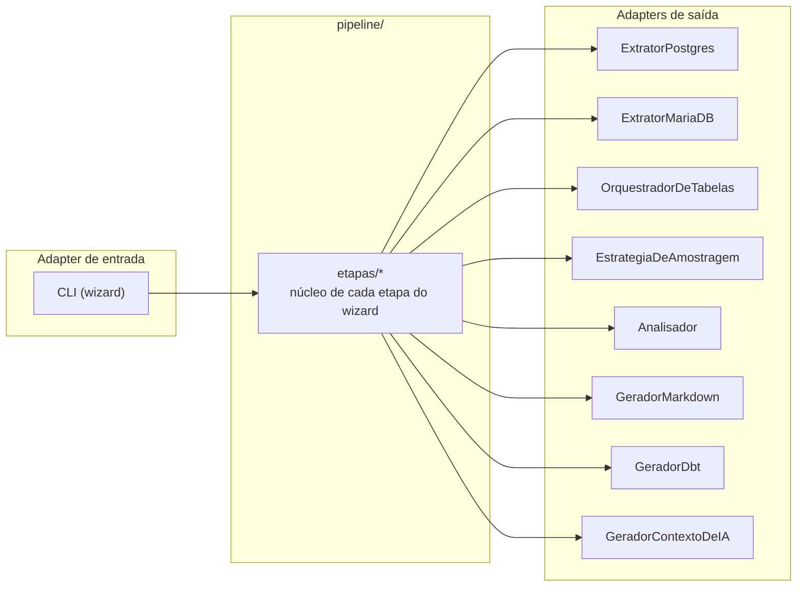

# Portas e adaptadores

Esta página detalha as cinco Portas do `ddf` (ver [Visão geral](index.md) para o desenho
geral): o critério que decide se algo vira Porta, quais são plugáveis por terceiro hoje,
como a CLI chega até elas, e como os dois Extratores da v1 implementam a mesma Porta sobre
motores de banco diferentes.

## O critério que decide se algo vira Porta

Nenhuma das cinco Portas nasceu por dogma de hexagonal. Cada uma corresponde a uma decisão
concreta, porque existe (ou está previsto existir) mais de uma implementação real para
aquele papel.

| Porta | Por que existe mais de uma implementação real |
|---|---|
| `Extrator` | Mais de uma fonte real (Postgres, MariaDB), todas produzindo o mesmo `TabelaExtraida` neutro. |
| `Analisador` | Mais de uma heurística de análise real, cada uma incorporada sem alterar as existentes. |
| `Gerador` | Mais de um formato de artefato (Markdown, dbt, contexto de IA), todos consumindo o mesmo `BancoAnalisado`. |
| `OrquestradorDeTabelas` | Mais de uma estratégia de execução (`OrquestradorParalelo` hoje, `OrquestradorDistribuido` com Ray/Celery no futuro). |
| `EstrategiaDeAmostragem` | Mais de uma política de amostragem real (`PercentualDeLinhas`, `TabelaInteira`, `AmostragemPorFaixa`), incorporada via `ConfiguracaoDeExtracao`. |

Sobrescrita, pelo mesmo critério, **não** é uma Porta, visto que existe uma única
implementação (YAML), sem variação real a acomodar (ver
[Hexagonal](index.md#hexagonal-ports-adapters-sem-a-receita-completa)).

## Política de extensão: quem é plugin, quem não é

`Extrator` e `Gerador` são reexportados em `domain/ports/__init__.py` como caminho de
import público, descobertos via `importlib.metadata.entry_points`
(`ddf.extratores`/`ddf.geradores`) e seguem versionamento semântico completo dado que mudar
assinatura de método existente é major, adicionar método opcional é minor, correção de
docstring é manutenção.

`Analisador` fica fora dessa política: não é reexportado nem é ponto de extensão de
terceiro, porque é a ACL entre Curation e Analysis, e todo Analisador registrado roda
incondicionalmente em toda execução, sem seleção do usuário (ver
[Analisadores](../guia/analisadores.md)).

`EstrategiaDeAmostragem` e `OrquestradorDeTabelas` são Portas no sentido arquitetural
(variação real de implementação, `@runtime_checkable`), mas não têm hoje o mesmo
compromisso de estabilidade externo sendo que nenhuma das duas é reexportada nem tem entry point
próprio nesta versão.

## CLI: adapter fino, `pipeline/` como fronteira única até as Ports

A CLI (`infrastructure/adapters/inbounds/cli/`) não chama nenhuma Port diretamente. Toda
chamada de Port que uma etapa do wizard precisa vive em `pipeline/etapas/`, um
módulo por etapa do wizard (`extracao.py`, `curadoria.py`, `analise.py`, `geracao.py`,
`validar_dependencias.py`). O que sobra em `cli/etapas/` é só UI: `prompts.*`, barra de
progresso, `sys.exit` em falha, formatação de mensagem.

`pipeline/comum/` é a outra metade do módulo, com o mecanismo genérico de composição
(`compor()`, o `Protocol` `Estagio`, `executar_com_seguranca`) reaproveitado tanto por
`pipeline/etapas/` quanto por `OrquestradorParalelo` (ver
[Pipeline e paralelismo](pipeline-e-paralelismo.md)).

## Extrator: dois motores, mesma Porta

`ExtratorPostgres` e `ExtratorMariaDB` implementam o mesmo contrato de `Extrator`. Nenhuma
outra camada do `ddf` sabe qual dos dois está em uso, porque o pipeline trabalha só com
`TabelaExtraida`, o tipo neutro que os dois produzem.

`EstrategiaDeAmostragem` é a Porta que `ExtratorPostgres` e `ExtratorMariaDB` consomem para
decidir como amostrar cada tabela, ela é injetada via `ConfiguracaoDeExtracao` e não hardcoded
em cada Extrator portanto trocar de `PercentualDeLinhas` para `AmostragemPorFaixa` é trocar o
objeto injetado. Nenhuma camada
acima do Extrator sabe que `tamanho_amostra` existe (comportamento completo em
[Estratégias de amostragem](../guia/amostragem.md); a Porta em si, e como cada motor
traduz a mesma política em SQL real, estão em
[Estratégia de amostragem](estrategia-de-amostragem.md)).

Todo parâmetro de método de Porta em `domain/ports/` é positional-only (`/` na assinatura).
O nome do parâmetro na Porta é só documentação, porque cada Extrator concreto pode usar
outro nome internamente quando o dialeto da própria fonte pedir (`ExtratorPostgres` usa
`schema`, não `escopo`, porque é assim que Postgres chama). Sem essa restrição, `mypy
--strict` aceitaria uma chamada por keyword contra uma variável tipada pela Porta mesmo
quando o Adapter concreto por trás usa outro nome, e isso quebraria só em runtime, com
`TypeError`.

## Como o Extrator lê o catálogo da fonte

Listar tabelas, colunas, chaves e restrições não é uma query genérica repetida entre os
dois motores: cada um tem convenções de catálogo próprias, e ignorá-las produz metadado
errado. Três exemplos reais:

- Particionamento declarativo no Postgres: sem tratamento, cada partição física de uma
  tabela particionada apareceria como uma tabela independente. `ExtratorPostgres` filtra
  via `pg_inherits` exigindo `relkind = 'p'` na tabela-mãe. Não basta excluir qualquer
  relação de herança: herança clássica (`INHERITS`, comum em bancos legados anteriores ao
  Postgres 10) usa o mesmo catálogo, mas é tabela real e independente, não fragmento de uma
  tabela lógica particionada.
- Chave estrangeira por OID, não por nome, no Postgres: ler FK via `information_schema`
  cruzando por `constraint_name` colide quando duas tabelas do mesmo schema usam o mesmo
  nome de constraint (uma convenção comum, tipo `fk_parent` repetida em várias tabelas
  filhas), e o resultado aponta para a tabela/coluna referenciada errada. `ExtratorPostgres`
  usa `pg_constraint` (`conrelid`/`confrelid`, identificadores internos do Postgres), que
  não depende de nome ser único.
- Restrição `UNIQUE` escopada por tabela no MariaDB: nomes de constraint no MariaDB são
  escopados por tabela, não pelo banco inteiro. Duas tabelas do mesmo banco podem ter uma
  `UNIQUE KEY` de mesmo nome (por exemplo, geradas por `UNIQUE(email)` em tabelas
  diferentes). `ExtratorMariaDB` inclui `table_name` no próprio `JOIN` entre
  `table_constraints` e `key_column_usage`, não só no `WHERE`. Sem isso, colunas de tabelas
  diferentes se misturariam ao consultar o schema inteiro de uma vez.
