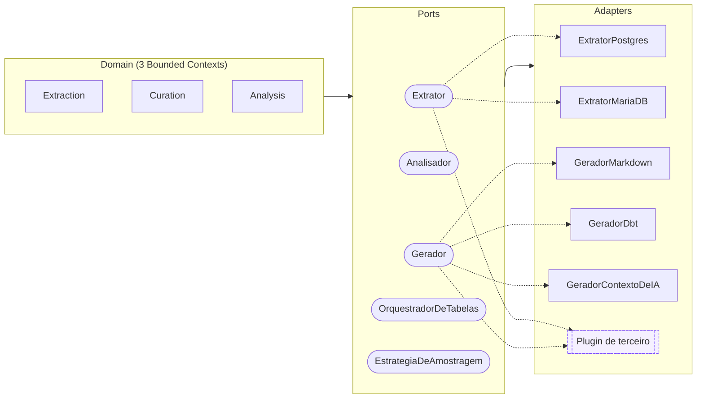

# Portas e adaptadores

Esta página detalha as cinco Portas do `ddf` (ver [Visão geral](index.md) para o desenho
geral): o critério que decide se algo vira Porta, quais são plugáveis por terceiro hoje, e
como os dois Extratores da v1 implementam a mesma Porta sobre motores de banco diferentes.

## O critério que decide se algo vira Porta

Nenhuma das cinco Portas nasceu por dogma de hexagonal. Cada uma corresponde a uma decisão
concreta: existe (ou está previsto existir) mais de uma implementação real para aquele
papel.

| Porta | Por que existe mais de uma implementação real |
|---|---|
| `Extrator` | Mais de uma fonte real (Postgres, MariaDB), todas produzindo o mesmo `TabelaExtraida` neutro. |
| `Analisador` | Mais de uma heurística de análise real, cada uma plugável sem alterar as existentes. |
| `Gerador` | Mais de um formato de artefato (Markdown, dbt, contexto de IA), todos consumindo o mesmo `BancoAnalisado`. |
| `OrquestradorDeTabelas` | Mais de uma estratégia de execução (`OrquestradorParalelo` hoje, `OrquestradorDistribuido` com Ray/Celery no futuro). |
| `EstrategiaDeAmostragem` | Mais de uma política de amostragem real (`PercentualDeLinhas`, `TabelaInteira`, `AmostragemPorFaixa`), plugável via `ConfiguracaoDeExtracao`. |

O mesmo critério explica por que Sobrescrita **não** é uma Porta: existe uma única
implementação (YAML), sem variação real a acomodar (ver
[Onde a adaptação para de seguir a receita](index.md#onde-a-adaptacao-para-de-seguir-a-receita)).
Transformar Sobrescrita em Porta seria abstração sem consumidor.

## Política de extensão: quem é plugin, quem não é

`Extrator` e `Gerador` são reexportados em `domain/ports/__init__.py` como caminho de
import público, descobertos via `importlib.metadata.entry_points`
(`ddf.extratores`/`ddf.geradores`) e seguem versionamento semântico completo: mudar
assinatura de método existente é major, adicionar método opcional é minor, correção de
docstring é patch. `ExtratorRegistrado` (a `dataclass` que carrega o entry point do grupo
`ddf.extratores`) segue a mesma disciplina, mesmo não sendo um `Protocol`.

`Analisador` fica fora dessa política: não é reexportado nem é ponto de extensão de
terceiro, porque é a ACL entre Curation e Analysis, e todo Analisador registrado roda
incondicionalmente em toda execução, sem seleção do usuário (ver
[Analisadores](../guia/analisadores.md)). Mudá-lo é refactor interno normal.

`EstrategiaDeAmostragem` e `OrquestradorDeTabelas` são Portas no sentido arquitetural
(variação real de implementação, `@runtime_checkable`), mas não têm hoje o mesmo
compromisso de estabilidade externo: nenhuma das duas é reexportada nem tem entry point
próprio nesta versão. Mudanças em suas assinaturas não exigem bump de versão pública.

## Domain, Ports e Adapters

Mermaid não desenha hexágonos concêntricos nativamente, então este diagrama aproxima a
ideia por camadas em vez de anéis: Domain como núcleo conceitual, Ports como fronteira,
Adapters irradiando para fora. Um plugin de terceiro (destacado em traço pontilhado) entra
como mais um Adapter encaixado em `Extrator` ou `Gerador`, sem alterar nenhum Port nem
tocar em nenhum dos três Bounded Contexts. É a mesma peça, encaixada de fora para dentro,
que reaparece em [Extensão via plugins](../extensao.md).

## Extrator: dois motores, mesma Porta

`ExtratorPostgres` e `ExtratorMariaDB` implementam o mesmo contrato de `Extrator`. Nenhuma
outra camada do `ddf` sabe qual dos dois está em uso: o pipeline trabalha só com
`TabelaExtraida`, o tipo neutro que os dois produzem.

`EstrategiaDeAmostragem` é injetada via `ConfiguracaoDeExtracao`, não hardcoded em cada
Extrator: trocar de `PercentualDeLinhas` para `AmostragemPorFaixa` é trocar o objeto
injetado, sem tocar em `ExtratorPostgres` nem `ExtratorMariaDB`. Nenhuma camada acima do
Extrator sabe que `tamanho_amostra` existe (comportamento completo em
[Estratégias de amostragem](../guia/amostragem.md)).

Todo parâmetro de método de Porta em `domain/ports/` é positional-only (`/` na assinatura).
O nome do parâmetro na Porta é só documentação: cada Extrator concreto pode usar outro nome
internamente quando o dialeto da própria fonte pedir (`ExtratorPostgres` usa `schema`, não
`escopo`, porque é assim que Postgres chama). Sem essa restrição, `mypy --strict` aceitaria
uma chamada por keyword contra uma variável tipada pela Porta mesmo quando o Adapter
concreto por trás usa outro nome, e isso quebraria só em runtime, com `TypeError`.

## Como o Extrator lê o catálogo da fonte

Listar tabelas, colunas, chaves e restrições não é uma query genérica repetida entre os
dois motores: cada um tem convenções de catálogo próprias, e ignorá-las produz metadado
errado silenciosamente. Três exemplos reais:

- Particionamento declarativo no Postgres: sem tratamento, cada partição física de uma
  tabela particionada apareceria como uma tabela independente. `ExtratorPostgres` filtra
  via `pg_inherits` exigindo `relkind = 'p'` na tabela-mãe. Não basta excluir qualquer
  relação de herança: herança clássica (`INHERITS`, comum em bancos legados anteriores ao
  Postgres 10) usa o mesmo catálogo, mas é tabela real e independente, não fragmento de uma
  tabela lógica particionada.
- Chave estrangeira por OID, não por nome, no Postgres: ler FK via `information_schema`
  cruzando por `constraint_name` colide quando duas tabelas do mesmo schema usam o mesmo
  nome de constraint (uma convenção comum, tipo `fk_parent` repetida em várias tabelas
  filhas), e o resultado aponta para a tabela/coluna referenciada errada. `ExtratorPostgres`
  usa `pg_constraint` (`conrelid`/`confrelid`, identificadores internos do Postgres), que
  não depende de nome ser único.
- Restrição `UNIQUE` escopada por tabela no MariaDB: nomes de constraint no MariaDB são
  escopados por tabela, não pelo schema inteiro. Duas tabelas do mesmo schema podem ter uma
  `UNIQUE KEY` de mesmo nome (por exemplo, geradas por `UNIQUE(email)` em tabelas
  diferentes). `ExtratorMariaDB` inclui `table_name` no próprio `JOIN` entre
  `table_constraints` e `key_column_usage`, não só no `WHERE`. Sem isso, colunas de tabelas
  diferentes se misturariam ao consultar o schema inteiro de uma vez.

Nenhum desses três é um detalhe cosmético: um filtro errado produz metadado incorreto sem
lançar nenhum erro, o tipo de bug que só aparece quando alguém nota o resultado errado no
artefato final.
