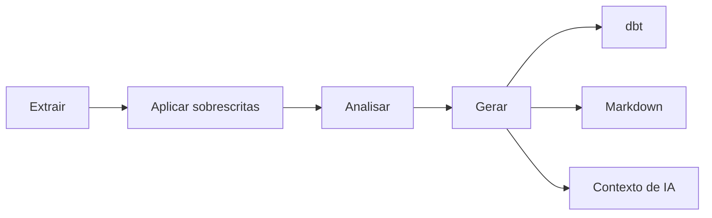

# ddf

Framework de análise em batch que transforma um banco relacional em projeto dbt, documentação e contexto de IA, extensível por plugins.

Bases relacionais acumulam tabelas, colunas e relações continuamente, e manter esse conhecimento registrado à mão é tarefa repetitiva que envelhece rápido. O `ddf` conecta diretamente à fonte (hoje Postgres e MariaDB) e lê, em paralelo, a estrutura de cada tabela junto com uma amostra real dos dados. A partir desse único levantamento, o `ddf` produz automaticamente três artefatos versionáveis.

## Extração

A conexão é feita por um adaptador nativo por fonte (hoje `ExtratorPostgres` e `ExtratorMariaDB`) que lê schema, tipos, chaves e uma amostra real de cada tabela, tabela por tabela, em paralelo. É o único ponto do `ddf` que abre conexão com o banco: tudo que vem depois trabalha sobre o que foi extraído. Detalhes de cada adaptador e das estratégias de amostragem disponíveis: [Guia do usuário](guia/extracao.md).

## Curadoria que sobrevive à reextração

Papel de negócio e regras de tabelas/colunas são registrados em [overrides YAML](guia/curadoria.md) e preservados entre reexecuções: reextrair a mesma fonte sem mudança estrutural nunca apaga o que já foi curado. Quando algo muda de fato, o `ddf` avisa exatamente o que mudou.

## Análise

Antes de gerar qualquer artefato, o `ddf` calcula métricas reais sobre os dados curados, automaticamente e sem decisão do usuário. Por coluna: percentual de nulos, percentual de valores únicos, valores mais frequentes, mínimo, máximo e formato detectado. Por tabela: completude média e um nível de confiança estatística sobre a amostra coletada. São essas métricas, não inferência, que alimentam os testes de qualidade sugeridos no `schema.yml` do dbt e as restrições marcadas na documentação Markdown. Detalhes de cada métrica: [Guia do usuário](guia/analisadores.md).

## Artefatos

Um artefato aqui é qualquer resultado gerado a partir da mesma extração e análise, versionável junto do restante do código-fonte. Todo artefato fica disponível para revisão normal de código antes de qualquer uso.

| Artefato | O que é |
|---|---|
| [**Projeto dbt**](artefatos/dbt.md) | `dbt_project.yml`, `sources.yml`, modelos de staging e `schema.yml` prontos para rodar. Os testes de qualidade sugeridos vêm de regras determinísticas sobre as métricas reais, nunca de inferência estatística. |
| [**Documentação Markdown**](artefatos/markdown.md) | Um arquivo por tabela: nome, papel de negócio, colunas com métricas e restrições (PK, FK, UNIQUE, NOT NULL) já marcadas. Lê-se direto no GitHub, sem visualizador externo. |
| [**Contexto de IA**](artefatos/contexto-ia.md) | `index.json` como ponto de entrada, mais um arquivo por tabela: um agente consegue carregar só o que precisa, sem abrir conexão com o banco. |

## Como funciona



O pipeline é conduzido por um wizard de linha de comando, decisão por decisão:

??? quote "O que você decide em cada etapa"
    ```
    Wizard
    ├── 1. Fonte e conexão: Postgres ou MariaDB, credenciais de acesso
    ├── 2. Escopos e tabelas: quais schemas/bancos e tabelas extrair
    ├── 3. Estratégia de amostragem: como cada tabela vai ser amostrada
    ├── 4. Extração: leitura paralela, sem decisões adicionais
    ├── 5. Curadoria: revisar e editar os overrides gerados
    ├── 6. Artefatos: quais gerar (dbt, Markdown, Contexto de IA)
    ├── 7. Análise: automática, sem decisão do usuário; calcula as métricas usadas na geração
    └── 8. Confirmação: executar de fato
    ```

Como cada etapa se conecta ao pipeline interno está detalhado em [Arquitetura](arquitetura/index.md).

O `ddf` aplica uma versão **adaptada** de hexagonal (Ports & Adapters) com DDD por Bounded Contexts, não a receita completa dos dois, mas o subconjunto que resolve o problema real do projeto. Os adaptadores nativos da v1 conectam a Postgres e MariaDB. Novas fontes e novos geradores de artefato se conectam via plugin, sem exigir reescrita do framework. Detalhes de design, diagrama de Bounded Contexts e as decisões de engenharia por trás disso estão em [Arquitetura](arquitetura/index.md).

## Comece por aqui

- [Instalação](instalacao.md): `pip install ddf-framework`, requisitos.
- [Guia rápido](guia-rapido.md): rodar o wizard de ponta a ponta com um exemplo real.
- [Guia do usuário](guia/extracao.md): cada etapa (extração, curadoria, amostragem, analisadores, avisos) em detalhe.
- [Extensão via plugins](extensao.md): registrar um Extrator ou Gerador de terceiros.
- [Notas da versão](notas-da-versao.md): o que está no escopo da v1.

Código-fonte e issues: [github.com/ThiagoLimaC/ddf](https://github.com/ThiagoLimaC/ddf).
